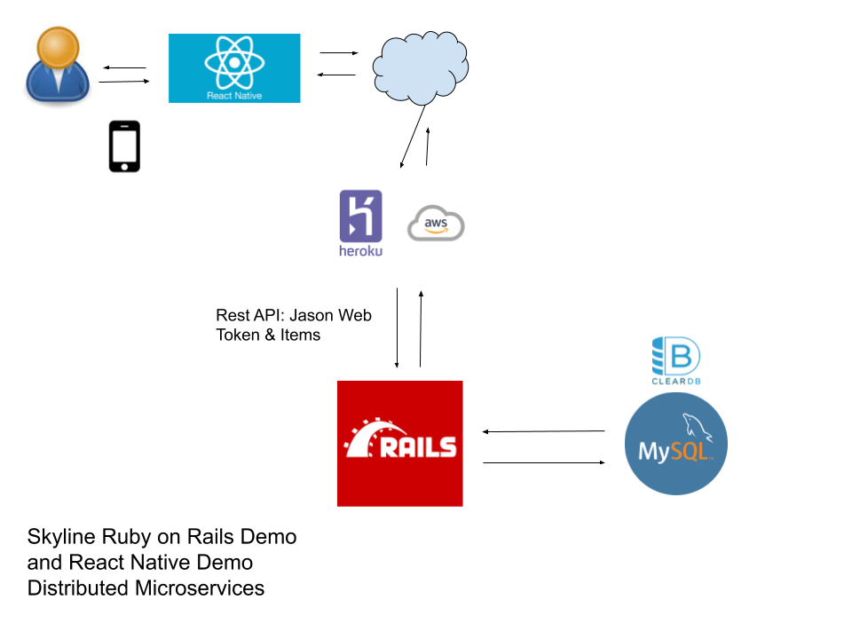

# skyline_ror_demo
ruby on rails backend for skyline

## Distributed Microservices Demo
"Skyline Ruby on Rails" is part of a complete distributed microservices demo that is fronted by a react-native-demo found [here](https://github.com/radkin/skyline-mobile-demo). 


# Start up dev environment
recommend rbenv install using [this](https://www.digitalocean.com/community/tutorials/how-to-install-ruby-on-rails-with-rbenv-on-ubuntu-18-04) link.

OS & Service requirements:

* For Ubuntu 18.04

```bash
sudo apt-get install mysql-server mysql-client libmysqlclient-dev
```

```bash
rbenv install 2.6.6
rbenv global 2.6.6
gem install bundler
bundle install
```

## Mysql quickstart
```bash
mysqladmin create skyline.dev
sudo su -
mysql
CREATE USER 'skyline'@'localhost' IDENTIFIED BY 'skyline';
grant all privileges on skyline.* to 'skyline'@'localhost';
flush privileges;
```

### Associated Rails quickstart
`rake db:schema:load`

after the initial load, then use this command for further schema changes
`rake db:migrate`

## Bootstrapping the server
In order for the server to run correctly you will need to obtain a secret key. If there is not a person who can provide a key for the present `credentials.yml.enc` you will have to re-create it. If you have a `production.key` or a `master.key` it will have to go in the correct place.

**Here is where our server expects an existing key**
```bash
./config/credentials/production.key
./config/master.key
```

### To regenerate keys
If you must regenerate the keys the first step is to delete the existing keys.
```bash
rm ./config/credentials/production.*
rm ./config/master.*
```
Then, run some commands to create them (This example: atom IDE and env prod)
```bash
EDITOR="atom --wait" bundle exec rails credentials:edit --environment=production
```

It will allow you to edit the file and this requires appending the existing contents with a single line. Here is an example:
```bash
secret_key_base: [LONG HASH HERE]
secret_key: "YOUR SECRET GOES HERE"
```

`bundle exec rails server`

you should now see the following (or similar)

```bash
=> Booting Puma
=> Rails 6.0.3.2 application starting in development
=> Run `rails server --help` for more startup options
Puma starting in single mode...
* Version 4.3.5 (ruby 2.6.6-p146), codename: Mysterious Traveller
```

### Testing your secret key
Open up your rails console and run a command that will reveal the key as follows:
```bash
bundle exec rails c
irb(main):012:0> Rails.application.credentials.secret_key
```
The response should be the secret key you entered. If not, it will likely be this: `"nil"`. If that is the case you will have to try the process again because it did not work.

## Looking in mysql

```bash
mysql

mysql> use skyline.dev
mysql> show tables

+-----------------------+
| Tables_in_skyline.dev |
+-----------------------+
| ar_internal_metadata  |
| items                 |
| products              |
| schema_migrations     |
| users                 |
+-----------------------+

mysql> describe items;

+-------------+--------------+------+-----+---------+----------------+
| Field       | Type         | Null | Key | Default | Extra          |
+-------------+--------------+------+-----+---------+----------------+
| id          | bigint(20)   | NO   | PRI | NULL    | auto_increment |
| name        | varchar(255) | YES  |     | NULL    |                |
| description | text         | YES  |     | NULL    |                |
| created_at  | datetime(6)  | NO   |     | NULL    |                |
| updated_at  | datetime(6)  | NO   |     | NULL    |                |
| category    | text         | YES  |     | NULL    |                |
| price       | float        | YES  |     | NULL    |                |
+-------------+--------------+------+-----+---------+----------------+

```

## The skyline REST API
To see raw data from the "Items" model you will need to create a user and obtain a JSON web token. Then, make a request using this token to the endpoint. Here are step by step directions:

**In one console:**
```bash
bundle exec rails c
User.create!(email: 'default@email.com' , password: 'aaaa111' , password_confirmation: 'aaa111')
```
**In another console:**
```bash
curl -H "Content-Type: application/json" -X POST -d '{"email":"defaulte@email.com","password":"abc111"}' http://localhost:3000/authenticate
```
The response will include a key: `{"auth_token":"LONG HASH"}` . Then, use it in your next request:
```bash
curl -H "Authorization: SAME LONG HASH" http://localhost:3000/items
```
If it worked, the response will be `[]`, but only because there is no data in the DB.

## Adding test data
```bash
bundle exec rails c
irb(main):012:0> Item.create!(name:'Kayak', category:'Watersports', description:'A boat for one person', price:275)
```
Using this approach you can start running the server.

## Author
radkin@github.com (not a proper email address)
